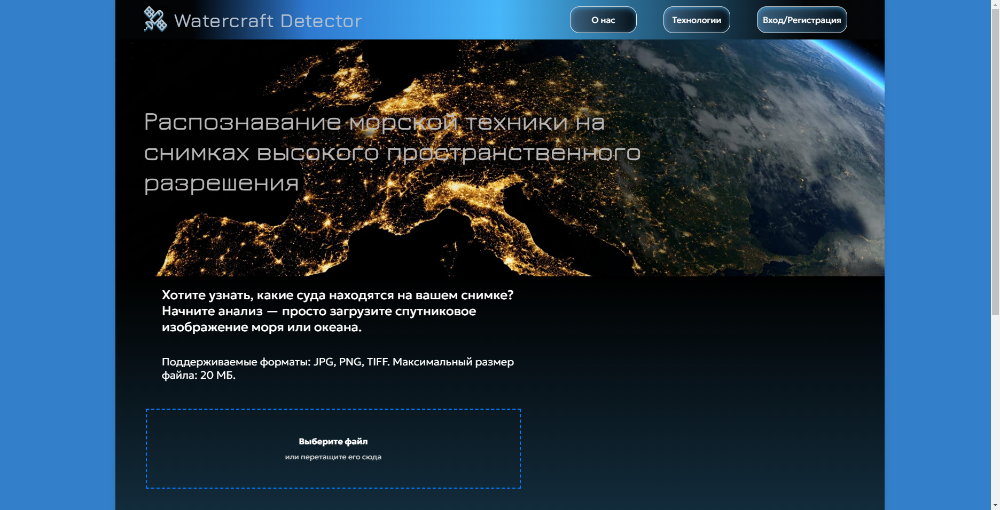

# Watercraft Detector

**Сервис распознавания морской техники на спутниковых снимках**



## 📌 Возможности

- Загрузка спутниковых изображений (JPG, PNG, TIFF)
- Автоматическое обнаружение судов
- Примеры результатов анализа
- Адаптивный интерфейс для всех устройств

## 🛠 Технологии

- **Frontend**: 
  
  
  

## 📂 Структура проекта

```
WatercraftDetector/
├── src/
│   ├── components/   # React-компоненты
│   ├── pages/        # Страницы приложения
│   ├── styles/       # Глобальные стили
│   └── App.js        # Корневой компонент
├── public/           # Статические файлы
└── package.json      # Зависимости
```
