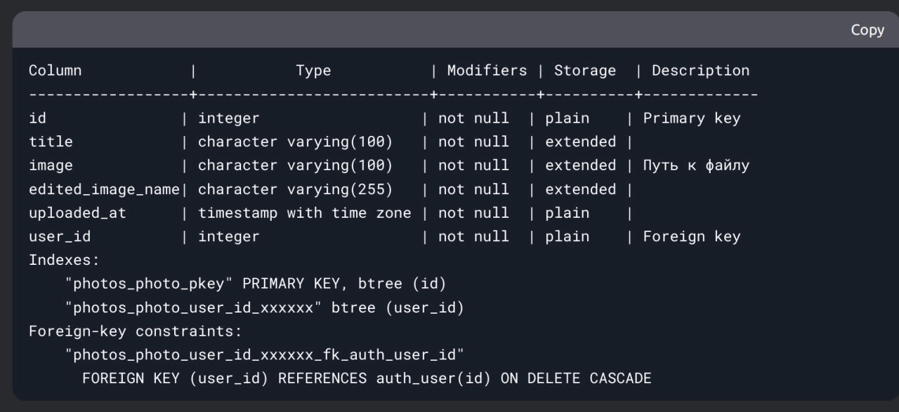

### Архитектурная документация

#### 1. Обоснование выбора архитектуры

Одна база данных с несколькими таблицами была выбрана по следующим причинам:

1. Простота развертывания:
- Требует только один контейнер PostgreSQL
- Упрощает резервное копирование и восстановление
- Минимизирует накладные расходы на обслуживание

2. Эффективность запросов:
- JOIN-операции между таблицами пользователей и фото выполняются быстрее в пределах одной БД
- Нет необходимости в распределенных транзакциях

3. Целостность данных:
- Внешние ключи (например, user_id в photos_photo) гарантируют ссылочную целостность
- Транзакции охватывают все связанные данные

4. Масштабируемость:
- При необходимости можно легко добавить репликацию
- PostgreSQL хорошо справляется с нагрузкой в таких конфигурациях

#### 2. Преимущества выбранного подхода

1. Производительность:
   - Все данные доступны через локальные соединения в БД
   - Индексы работают эффективно для связанных запросов

2. Согласованность:
   - ACID-транзакции гарантируют целостность данных
   - Каскадные обновления/удаления для связанных записей

3. Безопасность:
   - Единая точка управления правами доступа
   - Возможность использовать ролевую модель PostgreSQL

#### 3. Альтернативные варианты и почему они не были выбраны

1. Раздельные базы данных:
   - Требует сложной синхронизации
   - Нет преимуществ для текущего масштаба проекта
   - Усложняет резервное копирование

2. NoSQL решение:
   - Не обеспечивает необходимую целостность данных
   - Избыточно для реляционной структуры проекта
   - Требует перепроектирования моделей

3. Микросервисная архитектура:
   - Неоправданная сложность для текущих требований
   - Увеличивает задержки между сервисами
   - Требует дополнительной инфраструктуры

#### 4. Рекомендации по масштабированию

1. Вертикальное масштабирование:
   - Увеличение ресурсов контейнера PostgreSQL
   - Настройка индексов для часто используемых запросов

2. Горизонтальное масштабирование:
   - Добавление read-only реплик
   - Использование pgpool-II для балансировки нагрузки

3. Оптимизация:
   - Партиционирование таблицы photos_photo по дате
   - Кэширование часто запрашиваемых фото

Схема базы данных
